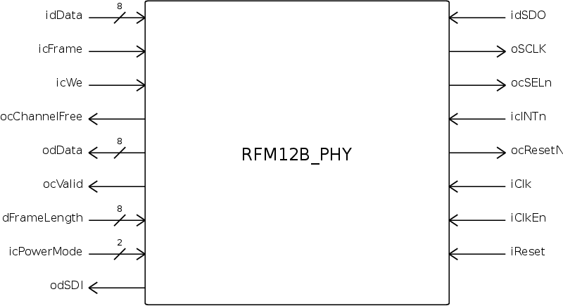

## Description
The main component of this VHDL project is a RFM12B physical layer component. A physical layer is the lowest component in the ISO/OSI model.

In the normal context the physical layer defines the electrical attributes of a communication, e.g. modulation/ demodulation, coding/ decoding. In this case the electrical attributes are already defined by the RFM12B component. Communication with the RFM12B is done through a SPI interface.

This PHY component implements the receiving and transmitting of a single byte through the RFM12B. It can be used by a data-link layer to transmit full frames.

Another component available in this project implements just
the SPI communication with the RFM12B.

## Dependencies

* TI-HSU SPI-Master component

## Usage
The following Image shows all available signals:

| Signal Name   |Length |  Direction | Description  |
| ------------- |:-----:|:----------:|-------------:|
| idData        | 8     | IN         | The byte to transmit |
| icFrame       | 1     | IN         | signals start and end of frame |
| icWe          | 1     | IN         | transmit idData, only works if ocChannelFree = 1 |
| ocChannelFree | 1     | OUT        | signals if a new Byte can be transmitted |
| odData        | 8     | OUT        | received byte |
| ocValid       | 1     | OUT        | the received byte is valid when 1 |
| idFrameLength | 8     | IN         | the length of a frame, can be changed during reception, RFM12B resets its transmission detection after this number of bytes |
|icPowerMode    | 2     | IN         | sets the power mode of the RFM12B |
|odSDI          | 1     | OUT        | SPI MOSI signal to the RFM12B |
|idSDO          | 1     | IN         | SPI MISO signal from the RFM12B |
|oSCLK          | 1     | OUT        | SPI Clock to the RFM12B |
|ocSELn         | 1     | OUT        | chip select signal to the RFM12B |
|icINTn         | 1     | IN         | interrupt input from the RFM12B |
|ocResetN       | 1     | OUT        | reset signal to the RFM12B |
|iClk           | 1     | IN         | system clock signal |
|iClkEn         | 1     | IN         | clock enable signal, shuts down the RFM12BPHY complely |
|iReset         | 1     | IN         | active high, clock synchronous reset signal |

More documentation can be found by generating the doxygen documentation or by looking into the VHDL files.

### Power Modes

* 00  Receiver active and check channel for a transmission window
* 01  Receiver active and do not check channel for a transmission window
* 10  full shutdown of RFM12B, if you want more power down use the iClkEn signal
* 11 reserved

## Contributors

You can contribute to this project in different ways:
* find bugs and provide bug reports through githubs issue system
* find bugs and provide solutions as pull requests through github
* you want to actively improve the project and get access to our gerrit instance

For the last two ways just send an email to mailto:dmeyer@hsu-hh.de.

## License

The RFM12B-PHY project is licensed under GPLv2.
